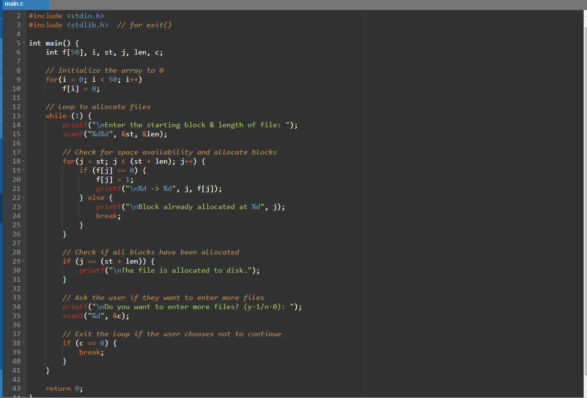
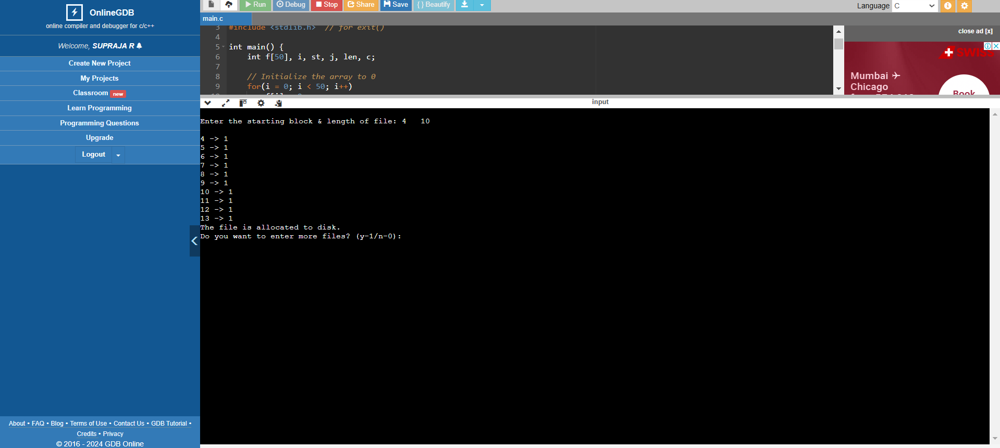
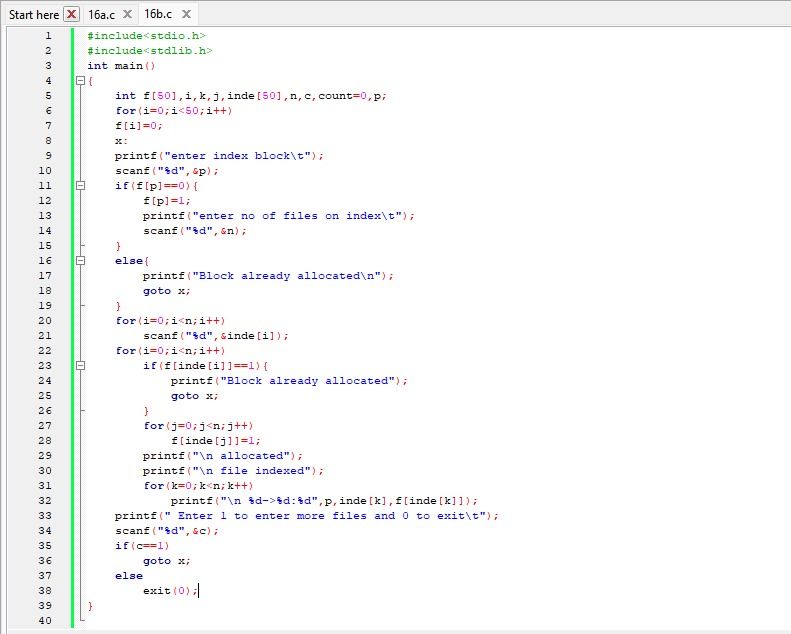
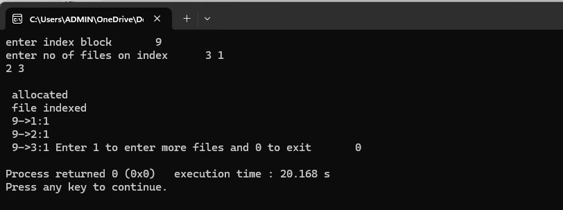
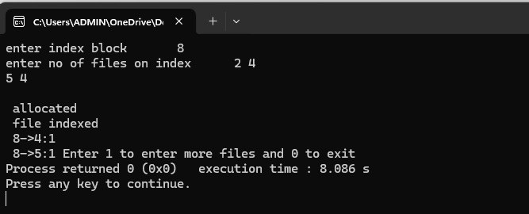
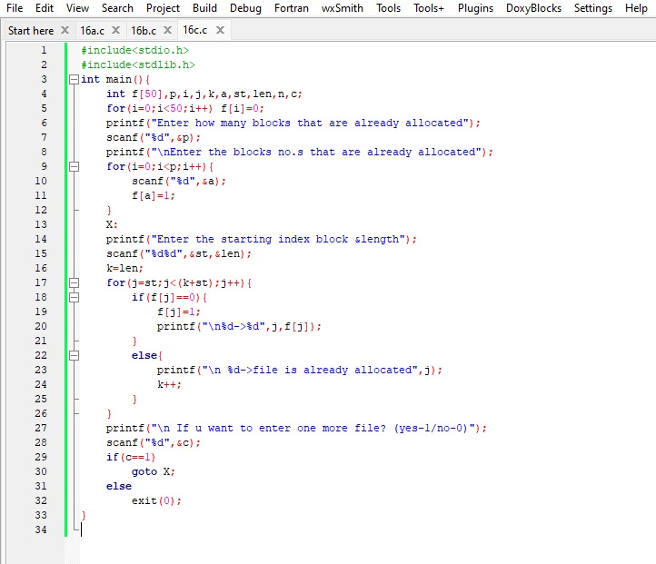

#SEQUENTIAL FILE ORGANIZATION

# program file

# sample output

# tested output

#INDEXED FILE ORGANIZATION

# program file

# sample output

# tested output

#LINKED FILE ORGANIZATION

# program file

# sample output

# tested output

